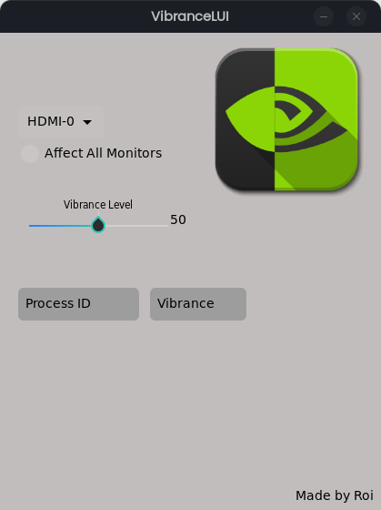

# VibranceLUI (Beta)

Control Nvidia's Digital Vibrance feature on Linux systems with this tool, with option to affect all displays or just the main one, as well as turning Vibrance only within a specific application.

Note that this tool isn't finished and is beta status, this means that certain features aren't implemented yet, such as per application settings. (This requires more effort I can't have right now)

Credit to [VibranceGUI](https://github.com/juv/vibranceGUI) for the inspiration.

TBD
----
* Per-Application Digital Vibrance.
## Contributing

Pull requests and feature suggestions are always welcome.

## Screenshots

